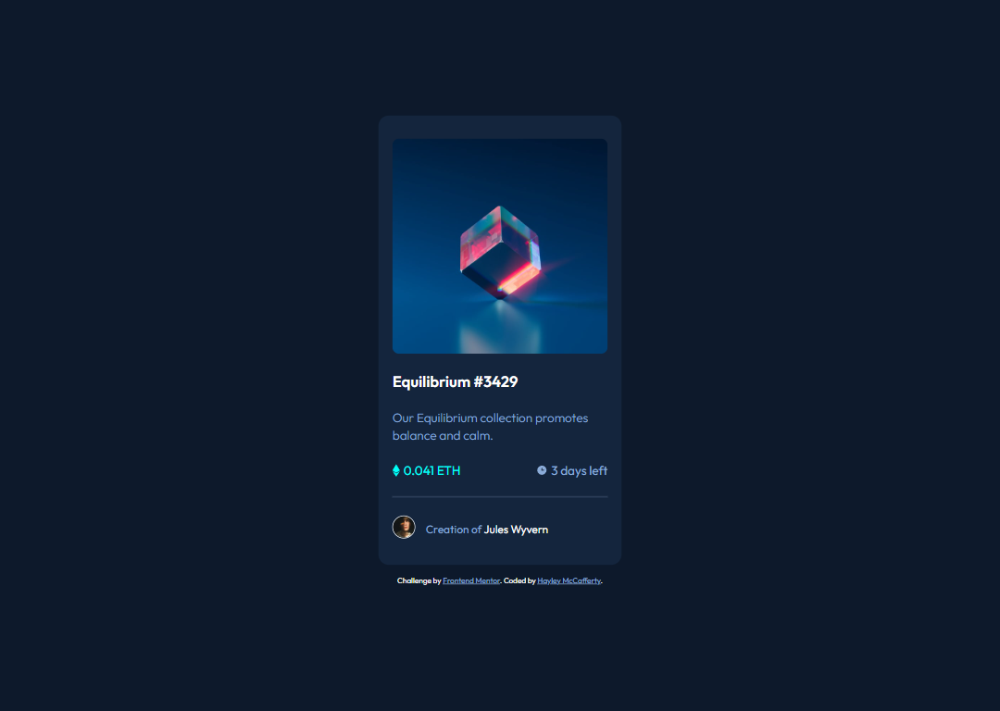
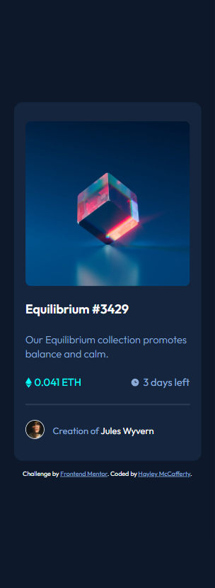

# NFT Preview Card Component

Challenge from [Frontend Mentor](https://www.frontendmentor.io/)

## Usage

The purpose of this project was to practice HTML and CSS skills with a design
from Frontend Mentor challenge

## Challenge Description

"This HTML & CSS only challenge is perfect for anyone just starting out or
anyone wanting a small project to play around with."

## Tech Stack

**Client:** HTML, CSS

## Authors

- [@haylzrandom - Frontend Mentor](https://www.frontendmentor.io/profile/HaylzRandom)
- [@HaylzRandom - GitHub](https://github.com/HaylzRandom)

## Acknowledgements

- [NFT Preview Card Component](https://www.frontendmentor.io/challenges/nft-preview-card-component-SbdUL_w0U)

## Related

Here are some related projects

- [Order Summary Component](https://github.com/HaylzRandom/order-summary-component)
- [Stats Preview Component](https://github.com/HaylzRandom/stats-preview-card-component)

## Screenshots

Desktop Screenshot 

Mobile Screenshot 

